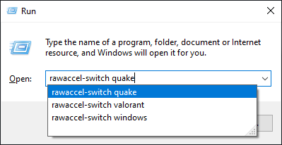
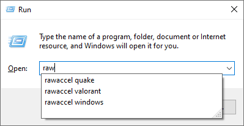
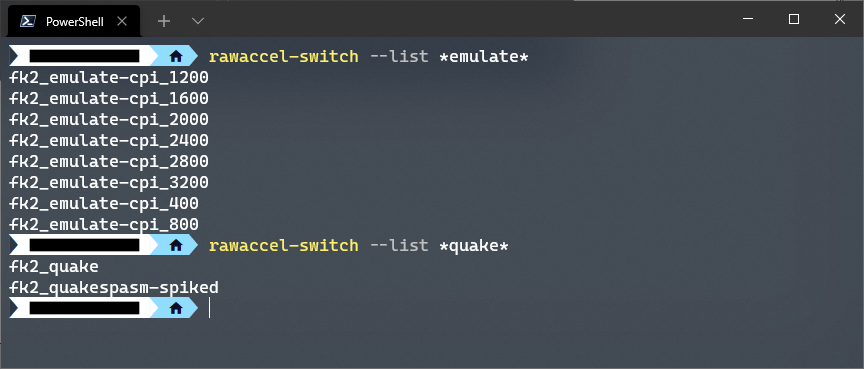
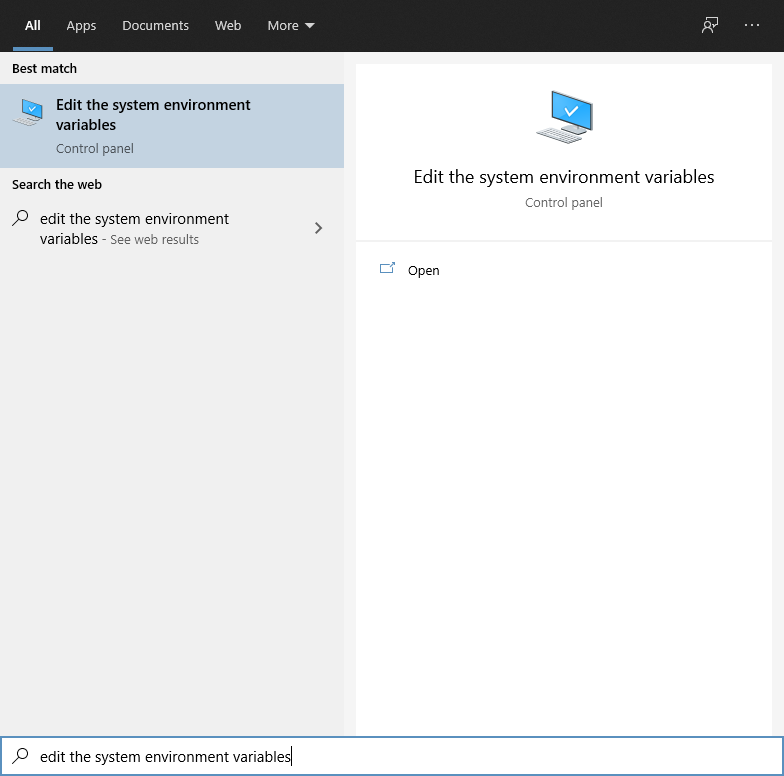
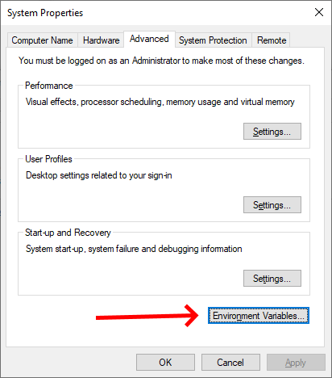
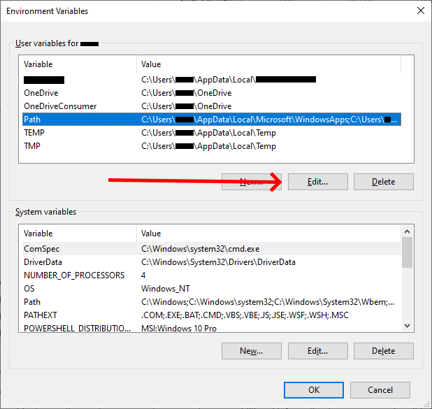
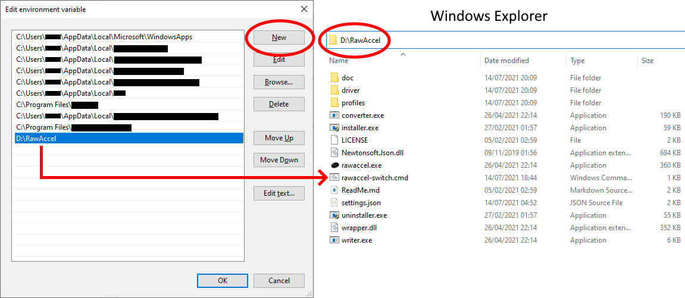
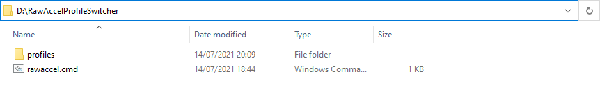
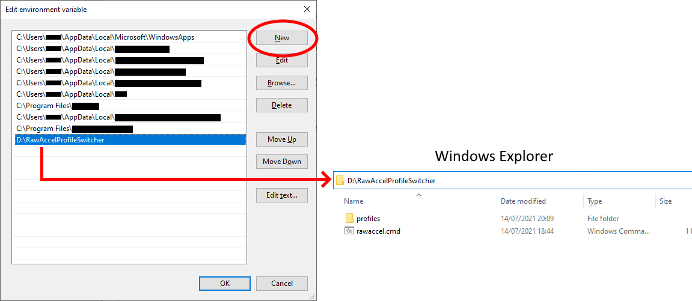
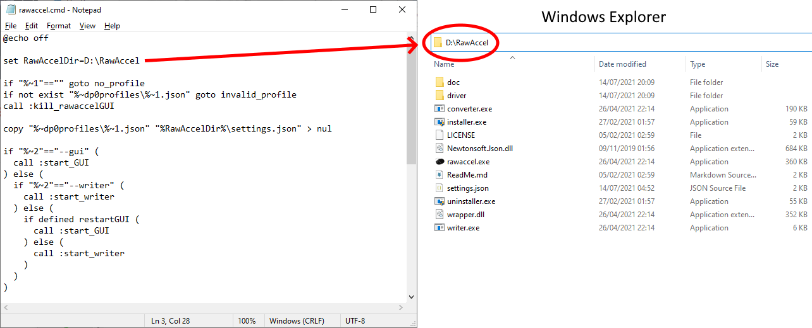

# Guide for RawAccel Profile Switcher (v1.0.4)

RawAccel Profile Switcher is a simple Batch script that allows you
to quickly save and switch between different [RawAccel](https://github.com/a1xd/rawaccel)
settings from the Command-Line Interface (CLI), including the Run
dialog (by pressing WinKey + R).

To save your current RawAccel settings, press WinKey + R, type in
`rawaccel-switch --save quake`, and then hit ENTER. To restore these
settings later, just type `rawaccel-switch quake`. When you are done
playing Quake, you could type in `rawaccel-switch windows` to switch
back to your preferred Windows settings (assuming you already have a
previously-saved profile under that name).

If you prefer, you can also use the simpler `rawaccel` command, rather
than the more cumbersome `rawaccel-switch` command, by slightly tweaking
the installation process. This is how I personally use it, but to set
it up in this way you will also be required to edit the Batch script
yourself to point to your particular RawAccel program directory. Don't
worry, this is relatively easy to do. Detailed instructions are found
at the [bottom of this guide](#how-to-install-as-rawaccel-rather-than-rawaccel-switch).

----

## Using RawAccel Profile Switcher

    rawaccel-switch [--save | --delete | --gui | --writer] <profile-name>
    rawaccel-switch --list [<profile-name-filter>]
    rawaccel-switch --help

When using the `--save` option, your current RawAccel settings will be
saved into the specified profile. If a profile already exists under
that name, it will overwrite the profile without asking for
confirmation. Be sure that this is what you want to do before using
this option.

When using the `--delete` option, this will cause the specified
previously-saved profile to be deleted so that it is no longer
accessible to RawAccel Profile Switcher. This will occur without
asking for confirmation, so be sure that this is what you want to do
before using this option.

When using `rawaccel-switch` without any of the options, this will simply
restore the specified profile and apply it to your current RawAccel
settings. For example, `rawaccel-switch windows` will restore and apply
the `windows` profile to your current RawAccel settings.

When restoring a saved profile, use the `--gui` or `--writer` options
if you want to enforce that the RawAccel GUI application is launched,
or that RawAccel's `writer.exe` is used. For more information on using
these options, see the section of this guide entitled
[Using the gui and writer options](#using-the-gui-and-writer-options).

Using the `--list` option will display a list of all saved profiles by
their profile names. You can also specify a filter, which can include
wildcards. For example, `rawaccel-switch --list fk2_*` will display a
list of all saved profiles that have names prefixed with `fk2_`.

The `--help` option will display the help text.

----

## The `Apply Settings.json On GUI Startup` option is recommended

Because of the way RawAccel Profile Switcher sometimes uses the
RawAccel GUI application to restore its settings, it is strongly
recommended that you enable the `Advanced` ➞ `Apply Settings.json On GUI Startup`
option within the GUI application. This option is enabled by default
anyway, so it is unlikely that you will need to change anything.

You can also enable this option using a text editor by opening up
RawAccel's `.config` file and making sure the `AutoWriteToDriverOnStartup`
field is set to `true`.

Without this option being enabled, whenever the RawAccel GUI
application is launched by RawAccel Profile Switcher, it will not apply
the restored settings to the RawAccel driver, nor will it even display
the restored settings within the GUI application. This is probably not
the behaviour that you want.

You can get away with not enabling this option if you intend to only
ever use the `--writer` option when restoring a saved profile.

----

## How to set up and use multiple RawAccel profiles

You can manually place your RawAccel `settings.json` files into the
`profiles` folder, each with unique filenames. These unique filenames
are the profile names that are used by RawAccel Profile Switcher.

So for example, if you rename your RawAccel `settings.json` file to
`quake.json`, and then move it into the `profiles` folder, you will
then be able to enter the command `rawaccel-switch quake` to restore
these settings later. What the restoration command does is overwrite
the current `settings.json` file with the `quake.json` file that you
placed within the `profiles` folder earlier. It will then apply these
settings to the RawAccel driver itself.

If you use the `--save` option, all of the file management is handled
for you. By entering the command `rawaccel-switch --save quake`,
RawAccel Profile Switcher automatically saves the current `settings.json`
file into the `profiles` folder for you, under the name `quake.json`.
This can be used to quickly save profiles without needing to manage
your JSON files manually.

So for example, to create a secondary RawAccel profile, use the RawAccel
GUI application as normal to edit your RawAccel settings, and then click
'Apply'. This will overwrite your `settings.json` file, but thankfully
your original `quake` profile still exists within the `profiles`
folder. Now you can enter the command `rawaccel-switch --save windows`
to automatically save this profile under the `windows` profile name.
You can now easily switch between the `quake` and `windows` profiles at
any time by simply typing their unique profile names on the restore
command. You are able to save any number of RawAccel profiles.

If you wish to update the `quake` profile at any time, you can simply
type `rawaccel-switch quake --gui` to restore the `quake` profile and
automatically bring up the RawAccel GUI application for editing. If
you don't use the `--gui` option, you can still open up the GUI
application yourself afterwards, as you normally would. Within the GUI
application, you can tweak your Quake settings, and then click 'Apply'.
When you are happy with your changes, enter the command
`rawaccel-switch --save quake` to overwrite your existing `quake`
profile with the changes you have just made. You can also manually edit
the JSON files within the `profiles` folder with a text editor, if you
prefer that method.

Always be careful when using the `--save` option to overwrite an
existing profile, as RawAccel Profile Switcher will NOT ask you for any
confirmation. If you overwrite an existing profile with garbage
settings, you will not be able to recover your old profile (unless of
course you make regular personal backups of your `profiles` folder).

You may also use the `--delete` option to delete a saved profile.
So for example, typing `rawaccel-switch --delete quake` will cause
`quake.json` to be deleted from the `profiles` folder, making it
completely unavailable to be used again. Again, be sure that this is
what you want to do before you use the `--delete` option, as RawAccel
Profile Switcher will NOT ask for confirmation before doing this.
If you delete a profile you will NOT be able to recover it, unless you
have a personal backup of the JSON file.

You can also use the `--list` option to display a list of all of the
saved profiles by their profile names. You can also specify a filter,
which can include wildcards. For example, the command
`rawaccel-switch --list *quake*` will display a list of all saved
profiles that contain `quake` in their profile names.

----

## Using the `gui` and `writer` options

By default, RawAccel Profile Switcher will use RawAccel's own GUI
application to apply restored settings to the driver when the GUI
application is already running, and `writer.exe` when the GUI
application is not currently running.

In other words, if the RawAccel GUI application is already running when
you enter the `rawaccel-switch quake` command, it will automatically
close the GUI application, restore the settings from the `quake`
profile, and then re-launch the GUI application. The GUI application
itself will then apply the restored settings to the RawAccel driver.

On the other hand, if the RawAccel GUI application is not currently
running when you enter the `rawaccel-switch quake` command, it will
simply use `writer.exe` to silently apply the restored settings to the
RawAccel driver, without ever launching the RawAccel GUI application.

The rationale behind this design is that, if you already have the
RawAccel GUI application open and you decide that you want to switch
RawAccel profiles using the `rawaccel-switch` command, you will
probably want to see the restored settings within the RawAccel GUI
application immediately. Otherwise, we shouldn't show anything.

This behaviour can be overridden, however. If you wish to enforce the
use of `writer.exe` to apply the restored settings, or alternatively
enforce that the RawAccel GUI application is launched, you can use the
`--writer` or `--gui` options respectively. So for example, if you
enter the command `rawaccel-switch quake --gui` when the RawAccel GUI
application is NOT currently running, RawAccel Profile Switcher will
restore the settings from the `quake` profile and then launch the GUI
application. The GUI application itself will apply the restored
settings to the RawAccel driver.

Conversely, if the RawAccel GUI application IS already running and you
enter the command `rawaccel-switch quake --writer`, the GUI application
will automatically close and `writer.exe` will be used instead to apply
the restored `quake` settings to the RawAccel driver, without
re-launching the GUI application. The RawAccel GUI application will
always close, even with this option, as otherwise the settings shown
within the GUI application will no longer correspond to the
currently-applied settings.

----

## How to install

To download RawAccel Profile Switcher, please visit the
[Releases page](https://github.com/strangebit/RawAccelProfileSwitcher/releases).

Extract `rawaccel-switch.zip` into your RawAccel program directory, such
that `rawaccel-switch.cmd` exists alongside `rawaccel.exe`, `writer.exe`,
etc. Doing this should also create an empty `profiles` folder. If it
does not, you can create an empty `profiles` folder manually.

Next, you will need to edit your `Path` system environment variable to
point it to your current RawAccel program directory. By doing this, the
`rawaccel-switch` command will become available to type on your CLI. To
do this, open the Start Menu and start typing 'Edit the system
environment variables'. Launch that when it appears in the suggested
results, and then click on 'Environment variables' at the very bottom
of the Advanced tab of the System Properties box that appears.

From here, select `Path` under 'User variables', and then click 'Edit'.
If you prefer, you can edit `Path` under 'System variables' instead,
which will affect all of your Windows user accounts, rather than just
your currently logged in user account.

From here, click 'New' and add the path of your RawAccel program
directory, as demonstrated in the screenshot below. Make sure that
this corresponds to your particular RawAccel program directory; do
not simply copy the example directory that is used in the screenshot.

Click OK. If everything was done correctly, you should now be fully
configured to use the `rawaccel-switch` command! It's time to kick ass
and chew bubblegum!

----

## How to install as `rawaccel`, rather than `rawaccel-switch`

If you would prefer to be able to type `rawaccel quake`, as I do,
rather than the slightly more cumbersome `rawaccel-switch quake`, you
will need to follow a different set of installation instructions. Then
you will need to slightly tweak the source code of the Batch script
by yourself.

Alternatively, you can simply rename `rawaccel-switch.cmd` to something
else that is more simple, like `raps.cmd`. Then you should be able to
type `raps quake` on the CLI instead. This works, but, if you want
to use `rawaccel` as the command, it would not. This is because of the
existence of the `rawaccel.exe` GUI application within the RawAccel
program directory. In that case, typing `rawaccel quake` on the CLI
would run `rawaccel.exe`, rather than RawAccel Profile Switcher's
`rawaccel.cmd`.

To set up the command as `rawaccel` then, you will need to extract
`rawaccel-switch.zip` into a separate directory that is unique and
different to your RawAccel program directory. Then, rename
`rawaccel-switch.cmd` to `rawaccel.cmd`. Now there are no conflicts
with `rawaccel.exe`, because it exists in a different directory.

So your RawAccel Profile Switcher directory should now look like this:

Next, you will need to edit your `Path` system environment variable to
point it to your RawAccel Profile Switcher directory. This is the one
that you have just created, NOT your RawAccel program directory. That
way, you ensure that the `rawaccel.cmd` command will become available
on your CLI, rather than the `rawaccel.exe` GUI application that
exists within your RawAccel program directory.

For instructions on how to edit your `Path` system environment variable,
just follow the same instructions given in the [How to install](#how-to-install)
section of the Guide. But, again, rather than using the path of your
RawAccel program directory, use the path of your RawAccel Profile
Switcher directory instead, as demonstrated in the screenshot below.
Again, make sure that this corresponds to your particular RawAccel
Profile Switcher directory; do not simply copy the example directory
that is used in the screenshot.

Finally, right-click on the `rawaccel.cmd` file found within your
RawAccel Profile Switcher directory and choose `Edit`. This should
bring up a text editor with the source code of the Batch script for
editing. Since under these modified instructions your Batch script
does not live within your RawAccel program directory anymore, you
will now need to tell it where your RawAccel program directory is.
To do this, simply change the line near the top from:

    set RawAccelDir=%~dp0

to

    set RawAccelDir=<RawAccelProgramDir>

where `<RawAccelProgramDir>` is your particular RawAccel program
directory, as demonstrated in the screenshot below. Once again,
make sure that this corresponds to your particular RawAccel
program directory; do not simply copy the example directory
that is used in the screenshot.

If your RawAccel program directory path contains spaces, do NOT enclose
the path within quotation marks. In other words, do NOT use:

    set RawAccelDir="D:\Raw Accel"

Instead, rather use:

    set RawAccelDir=D:\Raw Accel

Save the changes. If everything was done correctly, you should now be
fully configured to use the `rawaccel` command! Rip and tear!

## Optional patched `rawaccel.exe` GUI Application

RawAccel Profile Switcher will always launch the RawAccel GUI application
fully maximised. Unfortunately, the GUI application does not remember the
previous window size and positioning, otherwise enforcement of this
behaviour would not be necessary. If you do not like this auto-maximising
behaviour, you can edit the Batch script (`rawaccel-switch.cmd`) to
remove the `/MAX` option in the `:start_GUI` section.

I also have a patched version of the RawAccel GUI application
(`rawaccel.exe`) that you may wish to try, which can be found
[here](https://github.com/strangebit/rawaccel/releases). This patched
version is intended to be used with the `/MAX` option removed.

The patched version remembers the window's location on exit and
reapplies it on startup, which is a much better behaviour when using it
with RawAccel Profile Switcher. It also improves setting the initial
window size on startup so as not to see the ugly scrollbars, which is
the reason I was using the `/MAX` option to begin with. With the
patched exe I find this to be no longer necessary.

A big caveat however is that the window size changes I made may only
work properly on my machine. I don't really know. Your mileage may
vary. The code isn't great. I made it just for myself and more work
would be required before it is worth merging upstream, but I also find
no harm in sharing it here in case others can benefit from it too.
